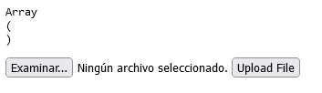
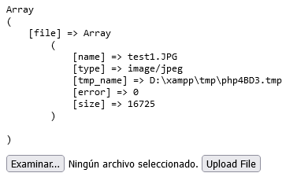
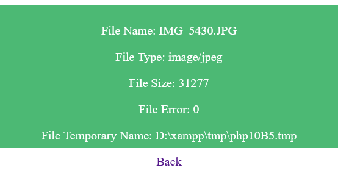
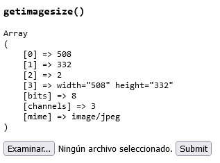
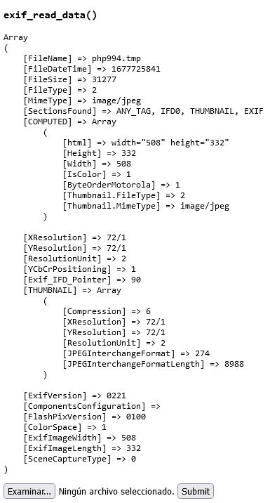

# PHP | $_FILES Array
How does the PHP file handle know some basic information like file-name, file-size, type of the file and a few attributes about the file which has been selected to be uploaded? Let’s have a look at what is playing behind the scene. **$_FILES** is a two-dimensional associative global array of items which are being uploaded via the HTTP POST method and holds the attributes of files such as:


| Attribute | Description |
| --- 		| --- |
| [name] 	| Name of file which is uploading |
| [size] 	| Size of the file |
| [type] 	| Type of the file (like .pdf, .zip, .jpeg…..etc) |
| [tmp_name]	| A temporary address where the file is located before processing the upload request |
| [error] 	| Types of error occurred when the file is uploading |


Now see How does the array look like??
```php
$_FILES[input-field-name][name]
$_FILES[input-field-name][tmp_name]
$_FILES[input-field-name][size]
$_FILES[input-field-name][type]
$_FILES[input-field-name][error]
```
<br/>

**Get image properties using PHP $_FILES**

PHP provides various functions and DLL to extract image properties from an image. These functions are:

1. imagesx() and imagesy()
2. getimagesize()
3. exif_read_data()


### 👨‍💻 Examples
- [Array $_FILES](https://github.com/jlammx/php_files/blob/master/show_all_attributes_array_files/show_attributes.php)  
Show all attributes of array $_FILES when uploading a file in the same page

- [HTTP file upload variables](http_file_upload_variables)  
Show all attributes of $_FILES when uploading a file on a different page (file upload manager)

- [Getting image properties](get_image_properties/index.php)  
Show the data or information that are associated with an image is called as metadata of the images. For example, image type, image width, and height, attributes, created date, last modified date and etc.

### 📸 Screenshots
> Array $_FILES
<p align="left">
	
	
</p>

> HTTP file upload variables
<p align="left">
	
	
</p>

> Getting image properties
<p align="left">
	
	
</p>


> 🔴 Live 
<p align="left">
	
	<a href=https://youtu.be/Fmv_-BsqLAs></a></img>
</p>


<!--
style="width:40%;"

[](https://youtu.be/zp7G6uLlve8)

<div align="left">
      <a href="https://www.youtube.com/embed/zp7G6uLlve8">
         
      </a>
</div>
-->


### 📈 Skills
<p align="left">
	<a href="https://dart.dev" target="_blank">
		
	</a> 
	<a href="https://www.w3.org/html" target="_blank">
		
	</a>
	<a href="https://www.w3.org/css3" target="_blank">
		
	</a>
</p>

<br/>

<p align="center">
	<div align="center" inline>
		<span> <a href="https://www.linkedin.com/in/jlammx/" target="_blank">
			</a>
		</span>
		&nbsp;&nbsp;&nbsp;&nbsp;
	</div>
</p>

<p align="center"> Last updated at 02 Mar 2023</p>